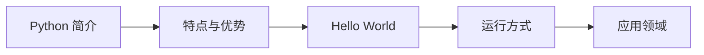

# Python 简介

<div className="intro-card">
  <h3>📖 章节导学</h3>
  <p>Python 是一种优雅、简洁且功能强大的编程语言。本章将带你了解 Python 的起源、特点以及如何编写第一个程序。</p>
</div>

## 什么是 Python？

Python 由 **Guido van Rossum** 于 1991 年创建，是一种解释型、面向对象的高级编程语言。它的设计哲学强调代码的可读性和简洁性。

> ✨ "Python 的设计哲学是优雅、明确、简单。" — Guido van Rossum

## Python 的优势

| 特点 | 说明 |
|------|------|
| 🧠 **简洁易学** | 语法简洁，接近自然语言，适合初学者 |
| 🌍 **应用广泛** | Web开发、数据分析、人工智能、自动化等 |
| 📦 **生态丰富** | 拥有超过 30 万个第三方库 |
| 🚀 **高效开发** | 用更少的代码实现更多的功能 |

## 第一个程序：Hello World

在 Python 中，打印 "Hello, World!" 只需要一行代码：

```python
print("Hello, World!")
```

### 代码解析

`print()` 是 Python 的内置函数，用于向屏幕输出内容：

- 引号内的文本称为**字符串**（String）
- `print()` 函数会自动在末尾添加换行符

### 多种输出方式

```python
# 使用双引号
print("Hello, World!")

# 使用单引号
print('Hello, World!')

# 使用三引号（多行字符串）
print("""这是
一个多行
字符串""")

# 数字输出（不需要引号）
print(2024)

# 表达式计算
print(1 + 1)
```

## 运行 Python 代码

### 方法一：交互式解释器

打开终端，输入 `python` 或 `python3` 进入交互模式：

```bash
$ python3
Python 3.11.0 (main, Oct 24 2022, 18:18:30)
[GCC 11.3.0] on linux
Type "help" for more information.
>>> print("Hello, World!")
Hello, World!
>>> 
```

### 方法二：脚本文件

将代码保存为 `.py` 文件，然后执行：

```bash
# 创建文件
echo 'print("Hello, World!")' > hello.py

# 运行脚本
python3 hello.py
```

### 方法三：在线环境

- [Replit](https://replit.com) - 浏览器内编程
- [Google Colab](https://colab.research.google.com) - Jupyter Notebook 环境
- [VS Code](https://code.visualstudio.com) - 强大的本地编辑器

## Python 能做什么？

```
┌─────────────────────────────────────────────────────────────┐
│                      Python 应用领域                          │
├─────────────┬─────────────┬─────────────┬──────────────────┤
│   🌐 Web开发   │   📊 数据分析   │   🤖 人工智能   │   🔧 自动化运维   │
│   Django    │   Pandas    │   TensorFlow │   Ansible       │
│   Flask     │   NumPy     │   PyTorch    │   Fabric        │
├─────────────┼─────────────┼─────────────┼──────────────────┤
│   🎮 游戏开发   │   📱 移动应用   │   🔬 科学计算   │   📝 脚本编写     │
│   Pygame    │   Kivy      │   SciPy      │   批处理自动化   │
└─────────────┴─────────────┴─────────────┴──────────────────┘
```

## 本章小结



| 知识点 | 内容 |
|--------|------|
| ✅ print() 函数 | 用于输出内容到屏幕 |
| ✅ 字符串 | 用引号包裹的文本 |
| ✅ 运行方式 | 交互式、脚本文件、在线环境 |

---

<div className="practice-box">

## 📝 随堂练习

学完本章内容，来检验一下学习成果吧！

👉 前往 [练习页面](/practice/ch01_basics) 完成以下任务：

1. **打印欢迎语** - 输出 `Welcome to Python!`
2. **自我介绍** - 用 print 语句打印你的名字和年龄
3. **计算输出** - 计算并输出 `365 * 24 * 60 * 60`（一年的秒数）

</div>

---

**[下一章预告]** → 变量和数据类型：了解如何存储和管理数据
